# Lab4Web
Praktikum 4 Membuat Web Dengan Layout Sederhana
## Membuat Box Element
> Langkah pertama, buatlah file bernama _lab4_box.html_ dan masukkan code seperti berikut :

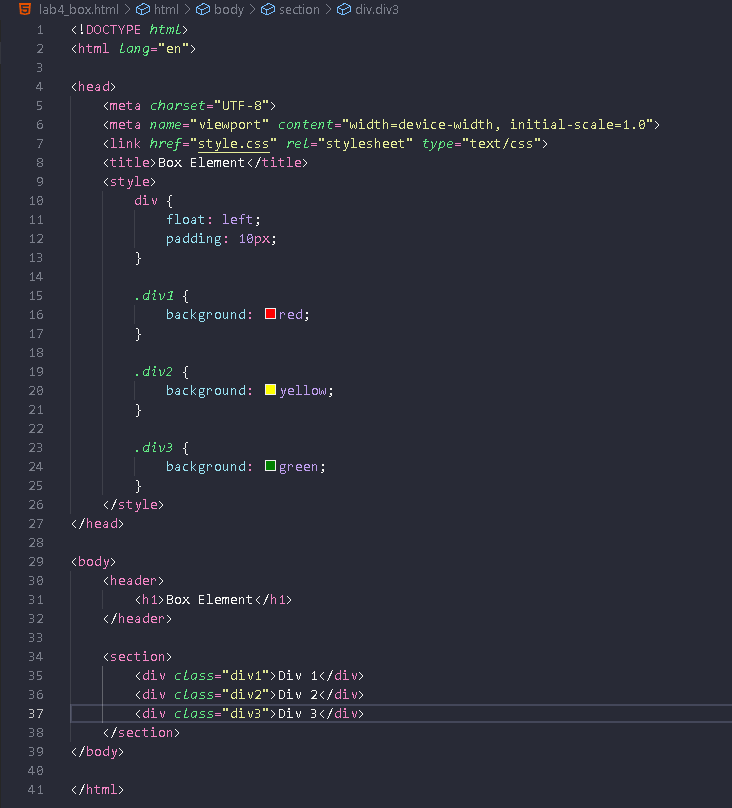
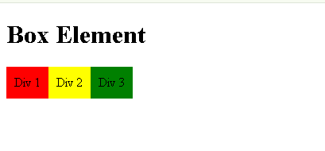

> Langkah kedua, mengatur Clearfix Element dengan menambahkan Property clear pada style seperti berikut :

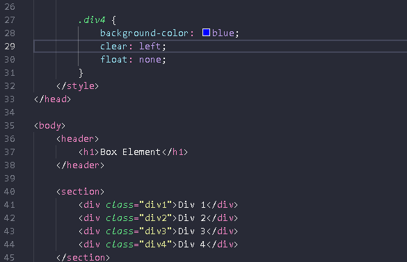
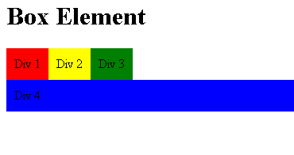

## Lalu kita akan membuat Web Dengan Layout Sederhana
> Langkah pertama, buatlah folder baru bernama _lab4_layout_ dan buat file baru bernama _home.html_ yang sudah ter-link pada _style.css_ dan masukkan code seperti berikut :

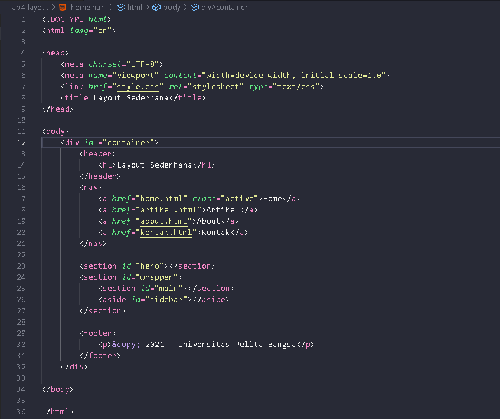
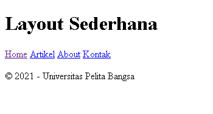

> Langkah kedua, tambahkan CSS pada Web untuk membuat layout nya seperti berikut :

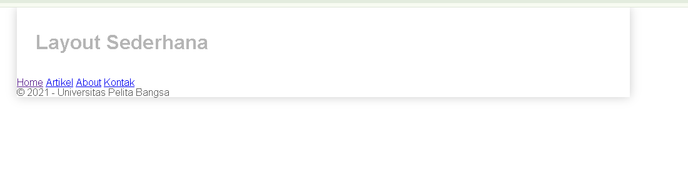
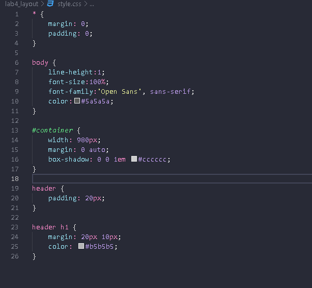

> Langkah ketiga, kemudian kita akan Mengatur bagian Navigasi pada CSS seperti berikut :

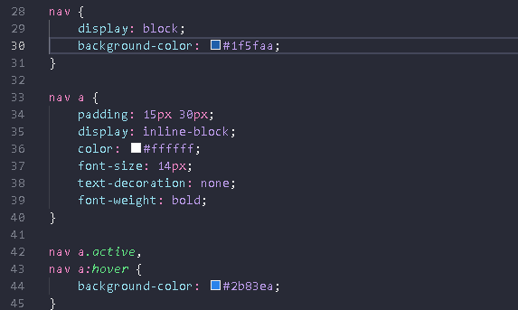
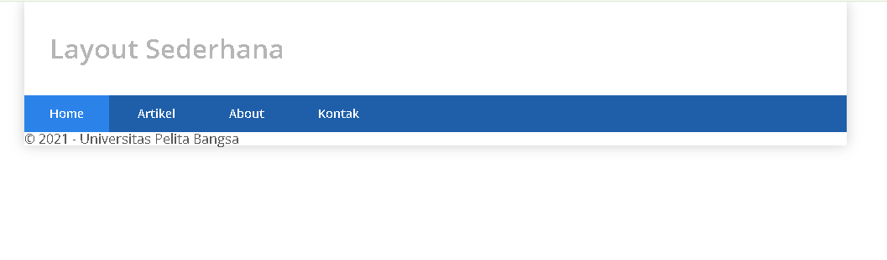

> Langkah keempat, kita akan membuat Hero panel pada HTML dan CSS seperti berikut :

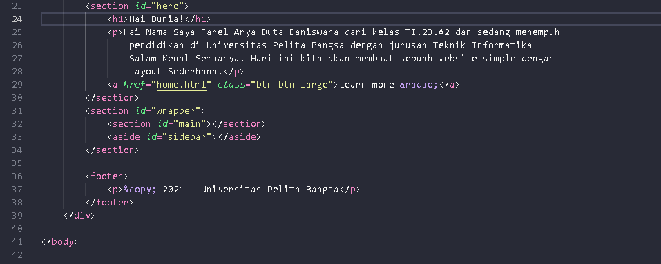
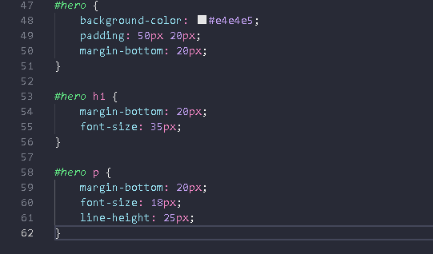
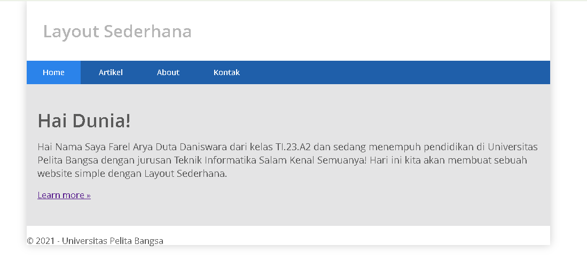

> Langkah kelima, mengatur Layout Main dan Sidebar dengan menambahkan float pada CSS seperti berikut :

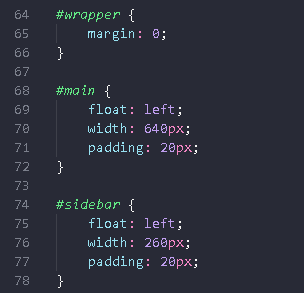

> Langkah keenam, kita akan membuat Sidebar Widget dengan menambahkan Elemen sidebar pada HTML dan Styling pada CSS seperti berikut :

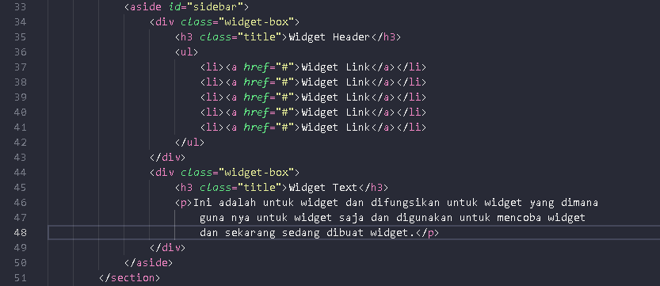
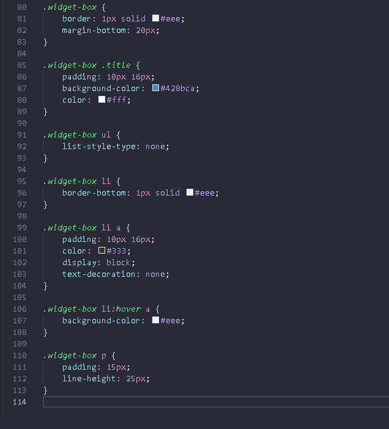
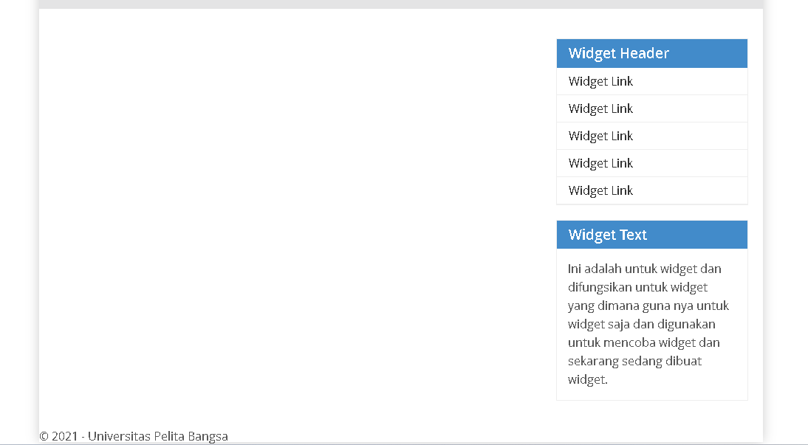

> Langkah ketujuh, lalu kita akan memberi CSS pada bagian footer seperti berikut :

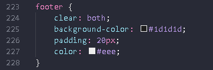

> Langkah kedelapan, kita akan menambahkan Elemen pada Content seperti berikut :

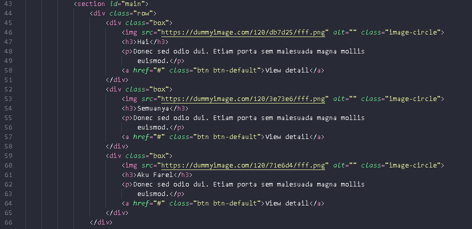
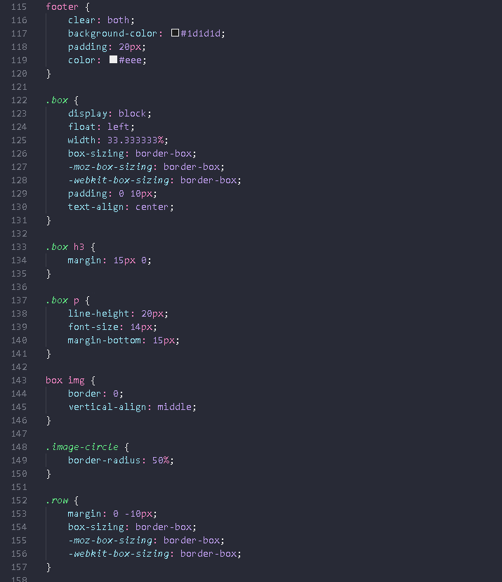
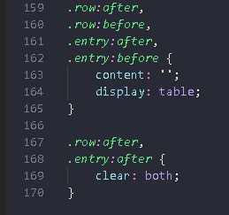
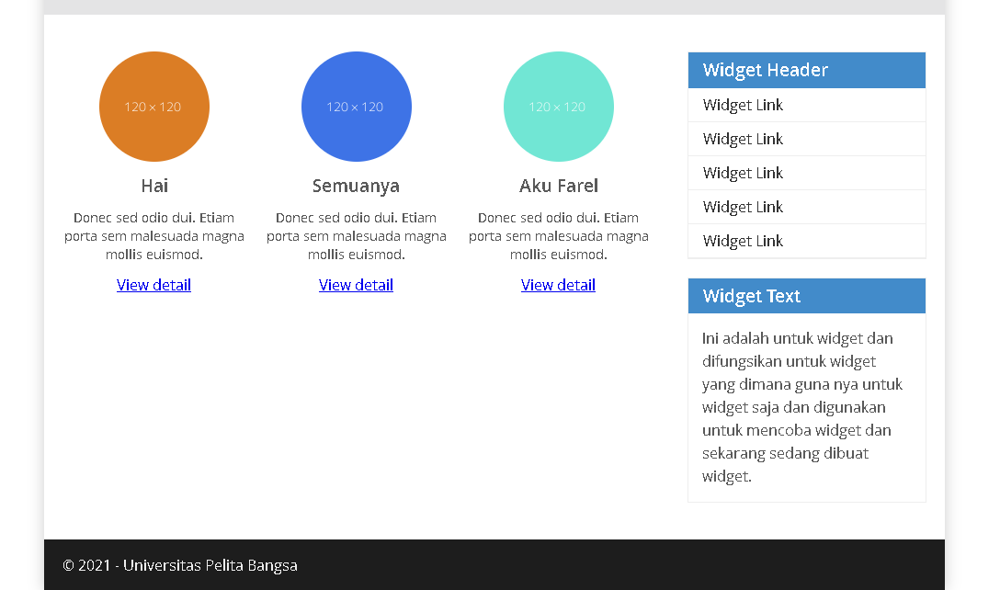

> Langkah kesembilan, terakhir kita akan membuat Content Artikel, dengan menambahkan HTML pada main content seperti berikut :

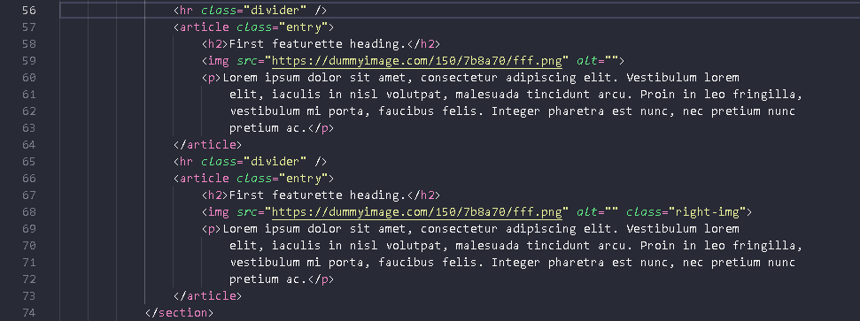
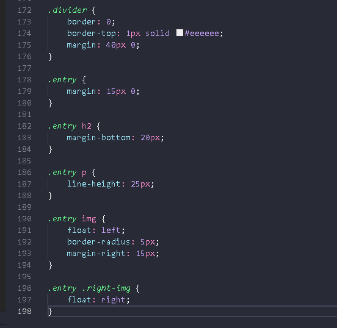
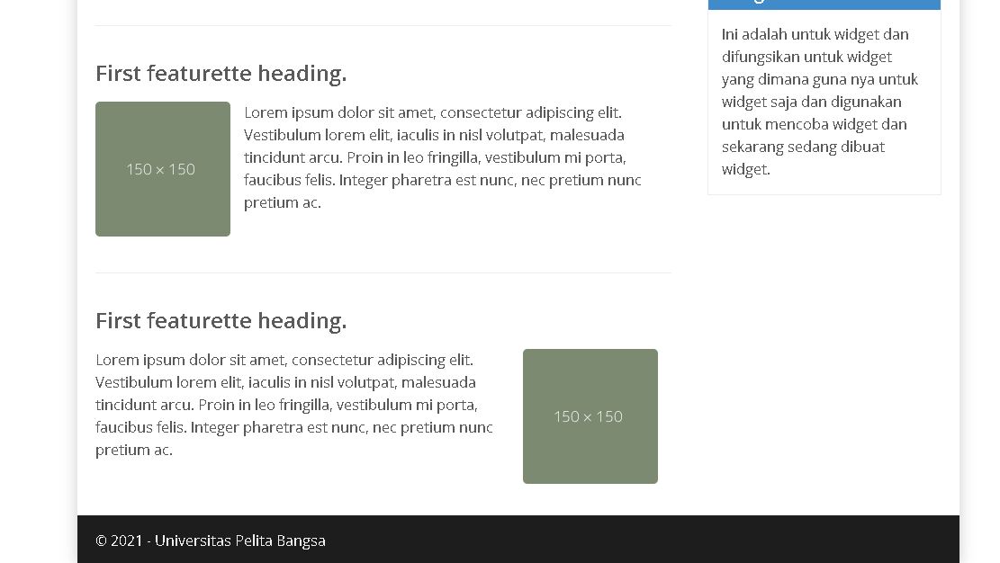